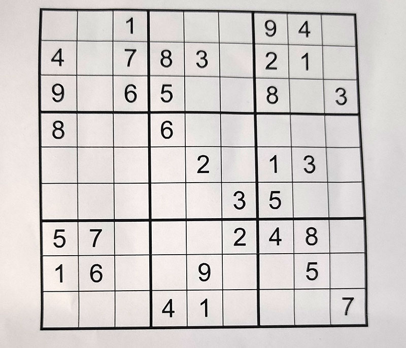

# 🧩 OpenCV Sudoku Solver

> Detect · Read · Solve · Overlay — all from a single photo.

[](https://github.com/siddhant-tyagi/sudoku-solver-opencv/actions)
[](https://python.org)
[](https://opencv.org)
[](https://tensorflow.org)
[](LICENSE)

A computer vision pipeline that takes a photo of a Sudoku puzzle, reads every digit using a convolutional neural network, solves it with a backtracking algorithm, and overlays the solution back onto the original image.

---

## 📸 Demo

| Input photo | Solved output |
|:-----------:|:-------------:|
|  |  |

---

## 🧠 Pipeline

```
Photo
  │
  ▼
Grayscale → Gaussian Blur → Adaptive Threshold
  │
  ▼
Contour Detection  ──→  Largest quadrilateral = Sudoku board
  │
  ▼
Perspective Warp (homography)  ──→  Clean top-down 450×450 view
  │
  ▼
Slice into 81 cells  ──→  CNN digit classifier (trained on MNIST)
  │
  ▼
9×9 integer board  ──→  Recursive backtracking solver
  │
  ▼
Draw solution digits  ──→  Inverse warp  ──→  Overlay on original
```

| Step | Technique |
|------|-----------|
| Board detection | `cv2.findContours` + `cv2.approxPolyDP` |
| Perspective correction | `cv2.getPerspectiveTransform` + `cv2.warpPerspective` |
| Digit recognition | Custom CNN (SudokuNet) trained on MNIST — ~99% accuracy |
| Solving | Recursive backtracking |
| Result overlay | Inverse homography warp |

---

## 📁 Project Structure

```
sudoku-solver-opencv/
│
├── main.py                    # Entry point (CLI)
│
├── src/
│   ├── preprocess.py          # Image → warped board → 81 cells
│   ├── digit_recognizer.py    # CNN model + MNIST training + inference
│   ├── solver.py              # Backtracking algorithm
│   └── overlay.py             # Draw & unwarp solution
│
├── models/
│   └── digit_classifier.h5    # Generated after training (git-ignored)
│
├── images/
│   └── sudoku.jpg             # Drop your puzzle images here
│
├── tests/
│   └── test_solver.py         # Pytest unit tests
│
├── .github/workflows/
│   └── tests.yml              # GitHub Actions CI
│
├── requirements.txt
├── LICENSE
└── README.md
```

---

## 🚀 Getting Started

### Prerequisites

- Python **3.11** — [Download here](https://www.python.org/downloads/release/python-3119/)
- Git — [Download here](https://git-scm.com/downloads)

### 1. Clone the repository

```bash
git clone https://github.com/siddhant-tyagi/sudoku-solver-opencv.git
cd sudoku-solver-opencv
```

### 2. Create a virtual environment

```bash
python -m venv venv

# Windows
venv\Scripts\activate

# macOS / Linux
source venv/bin/activate
```

### 3. Install dependencies

```bash
pip install --only-binary=:all: numpy opencv-python
pip install tensorflow imutils pytest
```

### 4. Train the digit classifier *(one-time, ~2 minutes)*

```bash
python main.py --train
```

Downloads MNIST and trains SudokuNet. Saves model to `models/digit_classifier.h5`.

### 5. Solve a puzzle

```bash
# Display result in a window
python main.py --image images/sudoku.jpg

# Save to file
python main.py --image images/sudoku.jpg --output images/solved.jpg
```

---

## 🧪 Run Tests

```bash
pytest tests/ -v
```

---

## 🏗 Algorithm Details

### Backtracking Solver

A depth-first search that places digits 1–9 in each empty cell, checks row / column / 3×3 box constraints, and backtracks on failure. Average solve time is under 1ms.

### SudokuNet (CNN Architecture)

```
Input (28×28×1 grayscale)
  → Conv2D(32 filters, 3×3, ReLU)  → MaxPool(2×2)
  → Conv2D(64 filters, 3×3, ReLU)  → MaxPool(2×2)
  → Flatten
  → Dense(128, ReLU)  → Dropout(0.5)
  → Dense(10, Softmax)
```

Trained on MNIST handwritten digits. Achieves ~99% test accuracy.

---

## 🛠 Tech Stack

- **Python 3.11**
- **OpenCV 4.8+** — image processing & computer vision
- **TensorFlow / Keras 2.13+** — neural network training & inference
- **NumPy** — matrix operations
- **pytest** — unit testing
- **GitHub Actions** — CI/CD

---

## 🤝 Contributing

Pull requests are welcome! For major changes, please open an issue first.

1. Fork the repo
2. Create your branch: `git checkout -b feature/my-feature`
3. Commit changes: `git commit -m "Add my feature"`
4. Push: `git push origin feature/my-feature`
5. Open a Pull Request

---

## 📄 License

[MIT](LICENSE) © 2025 Siddhant Tyagi
